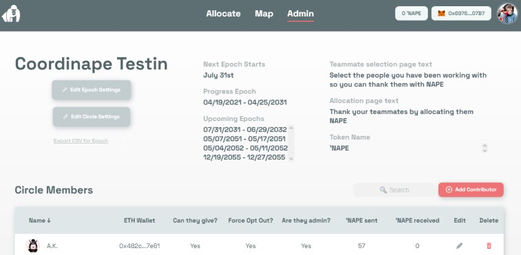
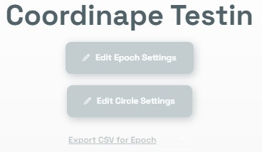

# Infos pour les admins

En tant qu'administrateur de Cercles, vous pourrez modifier les paramètres du Cercle, modifier les paramètres de l'Epoch et éditer les paramètres utilisateurs.

## Éditer les paramètres du Cerle \(Circle Settings\)

1. Cliquez sur le bouton **Edit Circle Settings** 
2. Indiquez le **Circle Name** \(nom du cercle\)
3. Indiquez le **token name** \(nom du jeton\)
4. Remplissez la **Teammate selection text** \(message qui sera affiché lorsque les membres choisiront leur "team"\)
5. Remplissez l' **Allocation page text**  \(message qui sera affiché lorsque les membres réaliseront leur allocation\)

## Éditer les paramètres de l'Epoch \(Epoch Settings\)

1. Cliquez sur **Epoch Settings**
2. Sélectionnez une date de commencement et une date de fin \(Epoch Start et End Date\) \(une fonction de récurrence arrive bientôt™\).
3. Cliquez sur **Save**
4. Vous pouvez aussi supprimer les Epochs qui ne sont pas actifs

   

   

## Ajouter des Utilisateurs/ Éditer les paramètres Utilisateurs \(Users/Editing User Settings\)

1. Les utilisateurs sont ajoutés à un cercle en cliquant sur le bouton **Add Contributor**  et les profils des utilisateurs peuvent être modifiés en cliquant sur le crayon à côté de leur nom. **Faites très attention lorsque vous saisissez les informations des utilisateurs, leur adresse de portefeuille doit être une adresse valide et ne comporter aucun espace au début ou à  fin, et elle ne peut pas être déjà utilisée dans ce cercle**. \(Si vous avez un grand nombre d'utilisateurs, contactez-nous sur Discord, nous pourrons vous aider en téléchargeant directement un fichier CSV\)

2. Ensuite, vous pouvez entrer leur nom, la quantité de jetons à distribuer, leur statut \(administrateur ou non\), forcer l'opt-out et s'ils peuvent ou non envoyer des GIVE.

3. Forcer la désinscription \(opt-out\) empêchera l'utilisateur de recevoir des GIVE. L'utilisateur sera alerté de ce changement via le Telegram Bot et sur la page des allocations. S'il leur a été attribué des GIVE avant de faire cette sauvegarde, ils seront tous supprimés et les utilisateurs qui les ont attribués devront les réattribuer à d'autres utilisateurs.

4. Vous pouvez également supprimer des utilisateurs du Cercle en cliquant sur la corbeille.

**Vous pouvez également un fichier .CSV a la fin de chaque epoch pour réaliser des analyses.**

