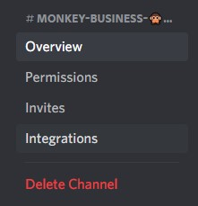

# Bot Discord

## Nouvelle Fonctionnalité : Le Bot Discord

Coordinape a été initialement conçu pour Yearn Finance, une DAO qui utilise énormément Telegram. Par conséquent, nos fonctionnalités de bot ont \(jusqu'à présent\) été centrées sur cette plate-forme. Nous avons maintenant commencé développer notre bot pour Discord et avons ajouté des fonctions d'intégration de webhook faciles au panneau d'administration de Coordinape. Lisez la suite pour en savoir plus et savoir comment le configurer. Plus de fonctionnalités seront ajoutées au bot au fil du temps.

## Qu'est-ce que le Bot Discord peut faire ?

* Caesar peut informer votre discord lorsqu'un utilisateur s'est retiré d'un epoch en cours et combien de GIVE ont été remboursés.

* Informer les utilisateurs qu'un epoch est en cours

  

* Informer les utilisateurs lorsque qu'un epoch est terminé

## Comment ajouter "Caesar" le bot discord a votre channel Discord ?

1. Cliquez sur **Edit Channel** sur le channel où vous souhaitez que les notifications du Bot apparaissent.

   

2. Aller dans **Integrations** -&gt; **View Webhook**

   

3. Cliquez sur **New Webhook** puis sur **Copy Webhook**

   

   

4. Allez sur l'app Coordinape  \(où vous êtes Admin\) et cliquez sur **Admin** 

   

5. Cliquer le boutton  **Edit Circle Settings**  et cliquez sur **edit webhook**

   

6. Coller l'url du webhook url  du bot Discord \(étape 3\) dans le champ dédié puis cliquez sur **Save**

### BOOM! Vous avez maintenant Caesar qui vous aide à garder une trace des epoch actifs, vous avertit lorsque les utilisateurs realisent des allocations et vous permet de savoir si un utilisateur se désengage. Nous ajouterons des fonctionnalités au bot au fil du temps, mais en attendant, nous espérons que vous apprécierez ces fonctionnalités !!

Si vous appréciez _ce Bot_, faite le savoir à Zashton ! 

Vous devrez peut-être utiliser le mode développeur \(_developer mode\)_ sur Discord pour ajouter le bot

