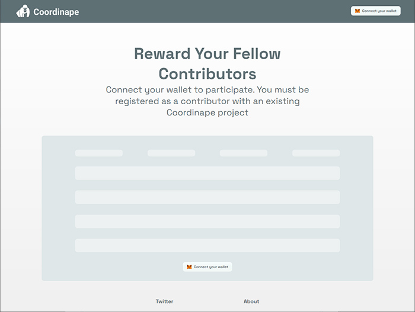
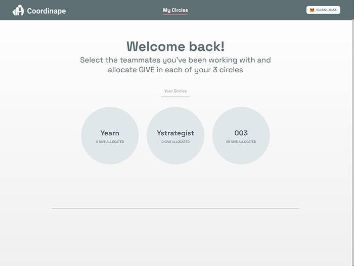
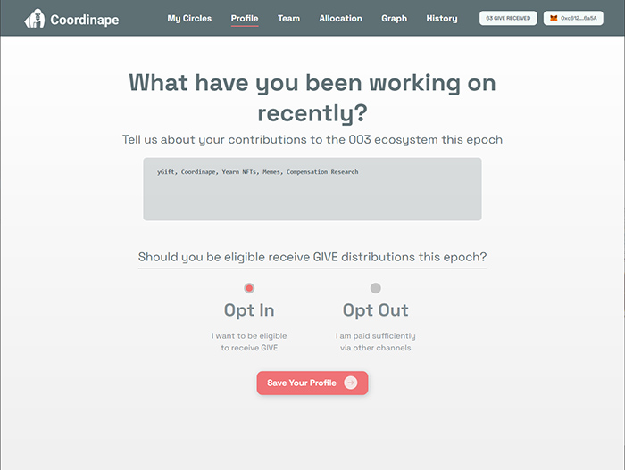
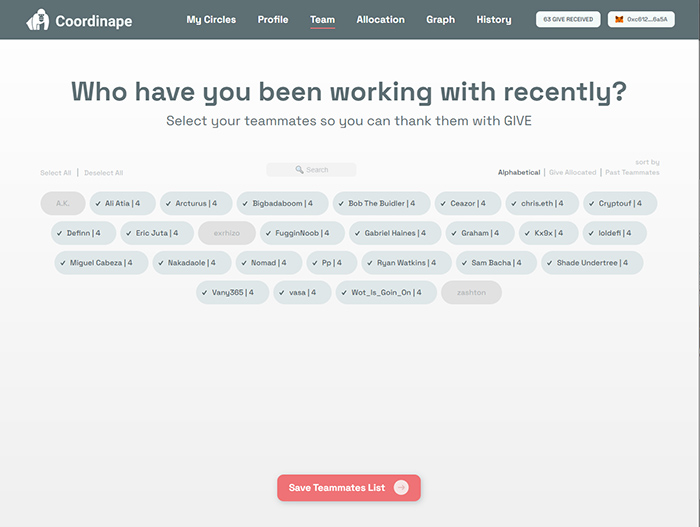
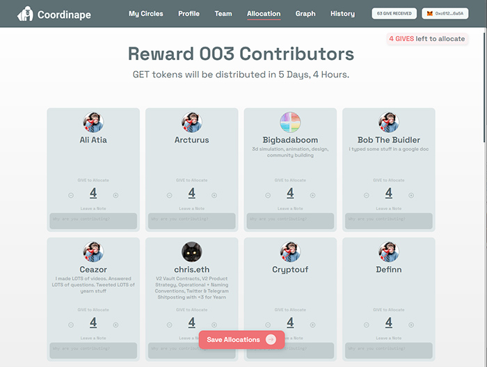
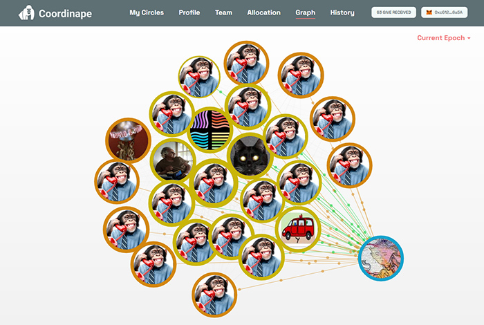
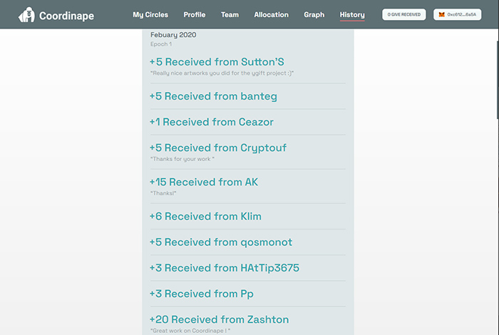

# Comment utiliser Coordinape

Dans cette section, vous trouverez un aperçu de l'utilisation de l'application web de Coordinape.

## Sélection du Cercle \(circle\) 

Lors de votre première visite sur le site Coordinape, vous devrez connecter votre portefeuille. Si vous cela ne fonctionne pas, votre portefeuille Eth n'a probablement pas encore été ajouté à un cercle. Contactez votre administrateur si tel est le cas.

Si vous avez accès à un ou plusieurs cercles, vous le verrez sur la page de sélection des cercles \(**your circles**\) :

A noter: vous devrez connecter votre portefeuille lorsque vous accéderez à un cercle pour la première fois.

## Page de profil \(Profile\)

La première fois que vous utilisez Coordinape, il vous sera demandé de répondre à quelques questions, ce qui aidera vos collègues à déterminer combien de GIVE vous donner.

La première est une description de votre profil. Cela peut être n'importe quoi. Il est public et sera visible par tous les membres du Cercle. Il peut donc être utilisé pour détailler le travail que vous avez effectué ce mois-ci ou clarifier ce pour quoi vous avez été rémunéré et ce pour quoi vous souhaitez être rémunéré durant cet epoch.

 La deuxième question est de savoir si vous allez accepter ou refuser de recevoir des GIVE durant cet epoch.

*  Si vous vous excluez \(_Opt Out\)_, vous signalez que vous avez d'autres sources de revenus provenant de Yearn qui sont importantes et que vous ne devriez pas recevoir de récompenses via coordinape. Il est également important de sélectionner cette option, si vous n'avez pas contribué durant le mois \(ou la période définie\) précédent.  Il sera ainsi impossible pour les autres membres de vous donner des GIVE.

* Si vous vous inscrivez \(_Opt In\),_ vous pourrez recevoir des GIVE. Vous pouvez utiliser la description de votre profil pour expliquer qu'elles en sont les raisons. 

L'un ou l'autre de ces paramètres peut être modifié au cours de l'epoch, ou pour les epochs futurs, en accédant à votre profil sur la page d'allocation \(Allocation Page\) pour les modifier. Si vous changez votre statut en Opt Out après avoir reçu des GIVE pendant un epoch, tous les GIVE que vous avez accumulés seront renvoyés aux personnes vous les ayants alloués.

## Éditer la page d'équipe \(Team Page\)

Vous serez  ensuite invité à utiliser la page de Sélection d'équipe \(Team Page\). Cette page vous permettra de choisir une petite liste de contributeurs, avec lesquels vous avez travaillé en étroite collaboration et que vous souhaitez récompenser. 

Sur cette page, vous pouvez sélectionner n'importe quel nombre de contributeurs, les trier ou chercher directement un membre avec son nom, pour trouver ceux avec lesquels vous avez le plus interagi.

* Le nombre de GIVE déjà alloué à chaque contributeur est indiqué pour que vous puissiez voir y retrouver plus facilement.
* Si vous supprimez un contributeur de votre liste après lui avoir attribué des GIVE, ses GIVE vous seront restitués \(lors de l'epoch en cours\).
* Après avoir sélectionné votre liste initiale, vous pouvez revenir sur cette page pour modifier votre équipe.

##  Page d'Allocation \(Allocation page\) 

La page Allocation vous permet de récompenser les membres que vous avez sélectionnés, en leur envoyant des GIVE.

 Ici vous pouvez :

* Parcourir les profils des contributeurs.
* Sélectionnez le nombre de GIVE que vous souhaitez envoyer aux contributeurs \(nombre entier\).
* Ajustez ces dons au cours de l'epoch.
* Consultez le solde de GIVE qu'il vous reste.
* Consultez le solde de GIVE que vous avez reçu jusqu'à présent.
* Laissez des notes aux contributeurs pour les remercier. Vous n'avez pas besoin d'allouer des GIVE pour laisser une note. 
* Vous pouvez également modifier  votre profil :
  * Nom,
  * Description,
  * Image d'Avatar,
  * Choix de Opt In / Opt Out .

## La page avec le graph de répartition \(Graph Page\) 

Coordinape fournit un graphique en temps réel pour montrer le mouvement de GIVE au sein d'un cercle.

* Cliquez sur un avatar pour voir une représentation animée du GIVE circulant vers et depuis chaque membre. 
* Les bandes autour du membre représentent le nombre de GIVE total que le membre a reçu durant l'epoch.
*  Vous pouvez également basculer pour afficher les epochs précédents, en utilisant le lien Epoch en haut à droite.

## Page de l'historique \(History Page\)

La page Historique vous permet de voir les GIVE que vous avez reçus, par membre, à n'importe quel epoch qui a déjà eu lieu.

Cette page affiche également les messages que vous avez reçus. 

