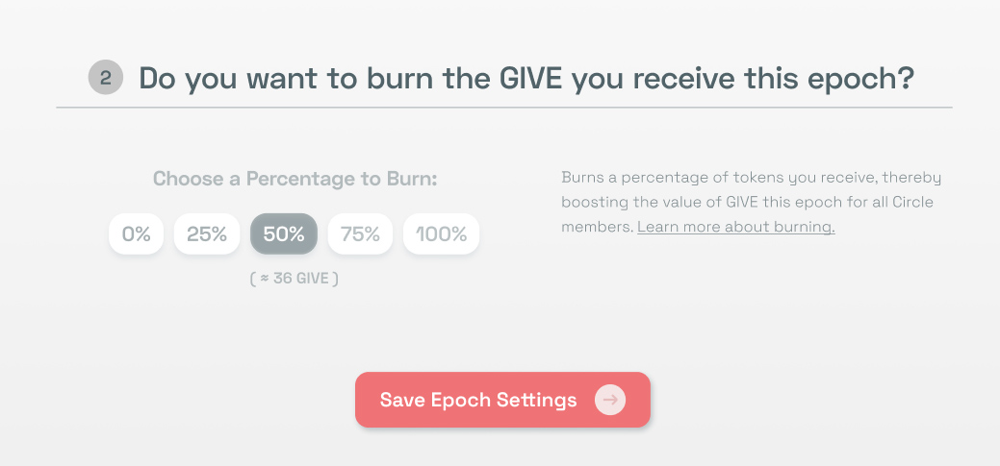

# New Feature: Re-Gifting

The latest version of Coordinape includes a new concept: Re-Gifting. This feature will allow contributors to decide what percentage of their GIVE they would like to keep or burn. Re-gifting lets people distribute their recieved GIVE in a more flexible way, and removes confusion around opt-in / opt-out decisions.

We have built this as a proof of concept, with simple choices, and encourage those that find it useful to try it out.

\*\* Please note that Re-Gifting has replaced Opt-Out. If you would like to opt out, you can choose to Re-Gift 100% of your tokens this epoch.

## Re-Gifting Options:

In the newest Coordinape version, each user can signal what they would like to do with their GIVE at the end of the epoch, by choosing a Re-Gifting amount. Re-Gifting will burn give you have recieved, which will increase the wieght of all GIVE that has been given to others. This is identified in the Epoch Settings page, and can be changed at any time during the epoch.

You can choose to:

* Re-Gift 0%. This means that the contributor will keep their GIVE, as a normal Opt-In option.
* Re-Gift 25%, 50%, 75%, 100%. This allows the contributor to choose percentages of their received GIVE to redistribute. This option will burn GIVE received, increasing the weight of unburned GIVE that is accrued across the circle.

## Re-Gifting Phase:

The last day of the epoch will be a 1 day window during which Re-Gifting can still occur. At this time, all initial GIVE has been allocated and locked, and only Re-Gifting options can be edited. When the Re-Gifting phase concludes, final results are displayed and the treasury distribution can be prepared.

Please note that your epoch timer \(on the Allocations Page\) will not include this day.

