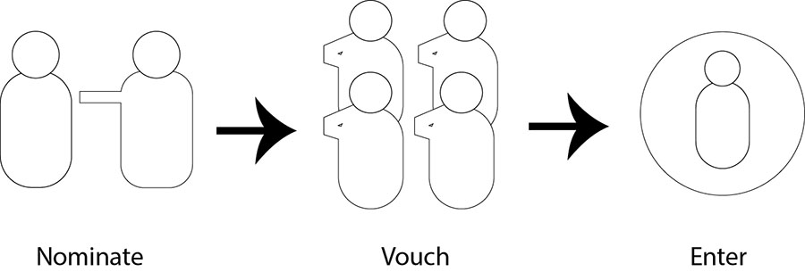
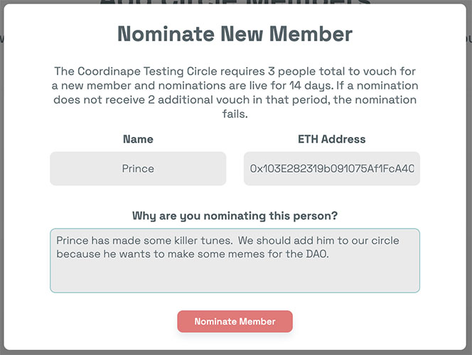
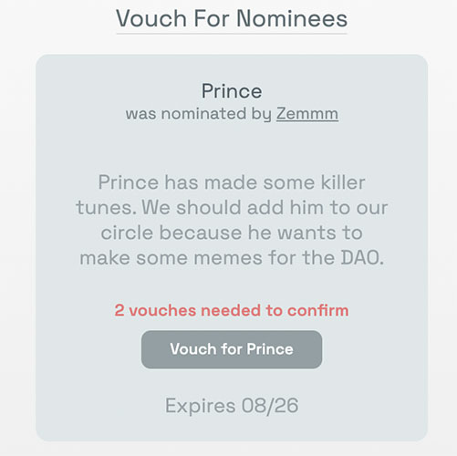

# Se porter garant \(Vouching\)

### Nouvelle Fonctionnalité : Le systeme de Vouching 

The DAO landscape is founded on self management and contribution, and we often hear the question: how should new contributors be inducted into a Gift Circle? While the borders of DAO membership might be as simple as landing in a Discord server or collecting NFTs or tokens, the additional trust layer of joining a circle to GIVE or receive may have different considerations. This may be performed by consensus, self determination, admin decisions or a blend of the three. Coordinape leaves this up to you.

Up to now, the Coordinape application has only allowed circle access via admin controls. This will likely always be a useful option, and some circles may choose to maintain this practice alone in an ongoing fashion \(which, of course, we will support\).

However, just as DAOs often form by autonomy and osmosis, we wanted to include more decentralized options by which a circle can grow. Our new Vouching system allows members to onboard new collaborators through a simple and flexible consensus mechanism. With Vouching, circles may determine their porosity via threshold settings, and contributors in a circle can actively engage in the management of its growth.

Le paysage DAO est fondé sur l'autogestion et la contribution, et nous entendons souvent la question : comment les nouveaux contributeurs devraient-ils être intronisés dans un Gift Circle ? Bien que les limites de l'adhésion à DAO puissent être aussi simples que d'atterrir sur un serveur Discord ou de collecter des NFT ou des jetons, la couche de confiance supplémentaire consistant à rejoindre un cercle pour DONNER ou recevoir peut avoir des considérations différentes. Cela peut être effectué par consensus, autodétermination, décisions administratives ou un mélange des trois. Coordinape vous laisse cela. 

Jusqu'à présent, l'application Coordinape n'autorisait l'accès au cercle que via les contrôles d'administration. Ce sera probablement toujours une option utile, et certains cercles peuvent choisir de maintenir cette pratique seule de manière continue \(ce que, bien sûr, nous soutiendrons\). 

Cependant, tout comme les DAO se forment souvent par autonomie et osmose, nous voulions inclure des options plus décentralisées grâce auxquelles un cercle peut se développer. Notre nouveau système de Vouching permet aux membres d'intégrer de nouveaux collaborateurs grâce à un mécanisme de consensus simple et flexible. Avec le Vouching, les cercles peuvent déterminer leur porosité via des paramètres de seuil, et les contributeurs d'un cercle peuvent s'engager activement dans la gestion de sa croissance.

### Voilà comment cela fonctionne:

## Setting Up Vouching for your Circle

Via admin controls, a circle admin can decide to enable or disable vouching. Admins can also set the number of vouches that are needed for circle entry, the period of time a nominee remains available to vouch, and some descriptive text for the module.  
Via les commandes d'administration, un administrateur de cercle peut décider d'activer ou de désactiver le répondant. Les administrateurs peuvent également définir le nombre de bons nécessaires pour entrer dans le cercle, la période pendant laquelle un candidat reste disponible pour se porter garant et un texte descriptif pour le module.

A vouch is a vote by a circle contributor to invite new members. Vouching can be as little as 1 vouch needed \(any contributor can add other contributors\) or could be set so that every member of the circle must vote to add a new member. If the minimum threshold of vouches is met, the contributor can gain access to the circle.

Un bon est un vote d'un contributeur du cercle pour inviter de nouveaux membres. Le répondant peut être aussi peu qu'un répondant nécessaire \(tout contributeur peut ajouter d'autres contributeurs\) ou peut être défini de sorte que chaque membre du cercle doit voter pour ajouter un nouveau membre. Si le seuil minimum de titres est atteint, le contributeur peut accéder au cercle.

## Nominating a Contributor

Usually, the vouching process will start on the social layer, via conversation or collaboration leading to a realization that someone in the community should added to a circle. When this happens, any member of the circle can nominate the provisional new contributor. They will need to add the member’s ETH address, name \(such as a Discord / Telegram username\) and a statement about why they are nominating.

Habituellement, le processus de caution commencera sur la couche sociale, via une conversation ou une collaboration menant à la prise de conscience qu'un membre de la communauté devrait être ajouté à un cercle. Lorsque cela se produit, tout membre du cercle peut désigner le nouveau contributeur provisoire. Ils devront ajouter l'adresse ETH du membre, son nom \(comme un nom d'utilisateur Discord / Telegram\) et une déclaration expliquant pourquoi ils nomment.

## Vouching

Once this has been performed, other circle members will see that the potential collaborator has been nominated, and they can take the step of Vouching for the member if they so chose.

Une fois cela effectué, les autres membres du cercle verront que le collaborateur potentiel a été nommé, et ils peuvent prendre l'initiative de se porter garant pour le membre s'ils le souhaitent.

If the new contributor is vouched for by enough of the circle’s current contributors to hit the circle’s vouching threshold, they are added to the circle and can log in with their favorite wallet app, set up profiles and begin to receive or send GIVE.

Future features will build on this process, including the addition of more surgical toggles that can determine the status of new members. And, admins still have the ability to remove members if mistakes are made. We at Coordinape are particularly excited about how this new module might aid DAOs in bootstrapping their communities and letting contributors participate in the active growth of their working teams. Please feel free to give it a try, or ask for more information in our Discord.

Si le nouveau contributeur est reconnu par suffisamment de contributeurs actuels du cercle pour atteindre le seuil de garantie du cercle, il est ajouté au cercle et peut se connecter avec son application de portefeuille préférée, configurer des profils et commencer à recevoir ou à envoyer GIVE.

 Les fonctionnalités futures s'appuieront sur ce processus, y compris l'ajout de plus de bascules chirurgicales qui peuvent déterminer le statut des nouveaux membres. Et, les administrateurs ont toujours la possibilité de supprimer des membres si des erreurs sont commises. Chez Coordinape, nous sommes particulièrement enthousiasmés par la façon dont ce nouveau module pourrait aider les DAO à démarrer leurs communautés et à permettre aux contributeurs de participer à la croissance active de leurs équipes de travail. N'hésitez pas à l'essayer ou à demander plus d'informations sur notre Discord.

