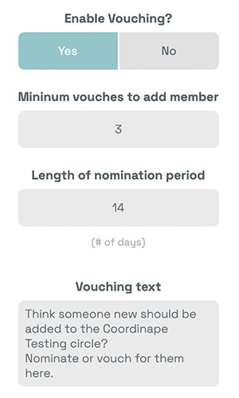

# Se porter garant \(Vouching\)

### Nouvelle Fonctionnalité : Le système de Vouching 

Le principe d'une DAO est fondé sur l'autogestion et la contribution, et nous entendons souvent la question : comment les nouveaux contributeurs peuvent-ils rejoindre un cercle sur coordinape ? Bien que les limites à l'adhésion d'une  DAO puissent être aussi simples que d'atterrir sur un serveur Discord ou de collecter des NFTs ou des jetons, l'étape de confiance supplémentaire consistant à rejoindre un cercle pour donner ou recevoir des récompenses peut être plus compliquée à obtenir.  Cela peut se faire par consensus, autodétermination, décisions administratives ou un mélange des trois. Coordinape vous laisse le choix. 

Jusqu'à présent, l'application Coordinape n'autorisait l'accès au cercle que via un contrôle au niveau des administrateurs. Cela sera probablement toujours une option utile et choisie par beaucoup de projet.

Cependant, de la même façon que les DAO se constituent souvent en totale autonomie et osmose, nous voulions inclure des options plus décentralisées grâce auxquelles un cercle peut se développer. Notre nouveau système de **Vouching** permet aux membres d'intégrer de nouveaux collaborateurs grâce à un mécanisme de consensus simple et flexible. Avec le Vouching, les cercles peuvent déterminer leur "porosité" via des paramètres de seuil.  Les contributeurs d'un cercle peuvent ainsi s'engager activement dans la gestion de sa croissance.

### Voilà comment cela fonctionne :

## Paramétrer le Vouching pour vos Cerles

Via les commandes d'administration, un administrateur de cercle peut décider d'activer ou de désactiver le vouching. Les administrateurs peuvent également définir le nombre de vouches \(recommandations\) nécessaires pour entrer dans le cercle, la période pendant laquelle un candidat peut se porter garant et un texte descriptif pour le module.

Un vouch est un vote d'un contributeur du cercle pour inviter un nouveau membre. Le vouching peut être réalisé lorsque seulement un membre vouch un nouveau membre \(c’est-à-dire que tout contributeur peut ajouter d'autres contributeurs\) ou peut être défini de sorte que tous les membres du cercle doivent voter pour ajouter un nouveau membre \(toutes les possibilités entre ces 2 exemples sont bien entendu possibles\). Si le seuil minimum de vouches est atteint, le contributeur peut accéder au cercle.

## Nominer un contributeur

Habituellement, le processus de vouching commencera sur la couche sociale, via une conversation ou une collaboration menant à la prise de conscience qu'un membre de la communauté devrait être ajouté à un cercle. Lorsque cela se produit, tout membre du cercle peut désigner ce contributeur comme potentiel futur participant au cercle. Ils devront ajouter l'adresse ETH du membre, son nom \(comme un nom d'utilisateur Discord / Telegram\) et une description expliquant pourquoi ils le nomment.

## Vouching

Une fois cela fait, les autres membres du cercle verront que le collaborateur potentiel a été nommé, et ils peuvent prendre l'initiative de se porter garant \(vouching\) pour le membre s'ils le souhaitent.

Si le nouveau contributeur est supporté par suffisamment de contributeurs actuels du cercle pour atteindre le seuil de vouching du cercle, il est ajouté au cercle et peut se connecter avec sa "wallet app" préférée, configurer son profil et commencer à recevoir et à envoyer des GIVE.

Les fonctionnalités futures s'appuieront sur ce processus et incluront l'ajout d'options précises pouvant déterminer le statut des nouveaux membres. Il est important de noter que les administrateurs ont toujours la possibilité de supprimer des membres si des erreurs sont commises. Chez Coordinape, nous sommes particulièrement enthousiasmés par la façon dont ce nouveau module pourrait aider les DAO à lancer leurs communautés et à permettre aux contributeurs de participer à la croissance active de leurs équipes de travail. N'hésitez pas à essayer cette nouvelle fonctionnalité  et à demander plus d'informations sur notre Discord.

